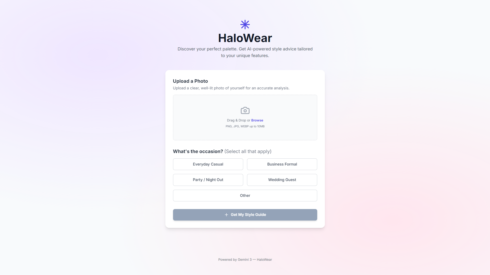

# HaloWear 🎨


**HaloWear** is an AI-driven personal stylist that analyzes your unique features—skin tone, undertones, hair, and eye color—to recommend the most flattering color palettes and clothing choices for any occasion.

Powered by **Gemini 3 Flash**, HaloWear transforms a simple photo into a comprehensive style guide.

## ✨ Key Features

- **Visual Color Analysis**: Uses advanced AI to identify skin tone and undertones from a photo.
- **Curated Palettes**: Generates custom color schemes (Power Colors, Neutral Basics, Accent Hues) specifically for your complexion.
- **Occasion-Specific Advice**: Tailors recommendations for Weddings, Business Formal, Casual, or Night Out settings.
- **PWA Experience**: Fully responsive, installable on mobile devices, and designed for a native-app feel.
- **Privacy Conscious**: Direct integration with the Gemini API ensuring your data is processed securely.

## 🚀 Quick Start

### 1. Prerequisites
- A Google Gemini API Key (get one at [aistudio.google.com](https://aistudio.google.com/))

### 2. Local Development
```bash
# Install dependencies
npm install

# Run the development server
npm run dev
```

### 3. Environment Configuration
Create a `.env` file or set the environment variable:
`API_KEY=your_gemini_api_key_here`

## 🛠️ Tech Stack

- **Frontend**: React 19, TypeScript
- **Styling**: Tailwind CSS
- **AI Engine**: Google Gemini 3 Flash (`@google/genai`)
- **Build Tool**: Vite 6
- **Deployment**: Vercel

## 📦 Deployment to Vercel

The easiest way to deploy is via the Vercel Dashboard:

1. Connect your repository.
2. Ensure the build command is `npm run build` and output directory is `dist`.
3. **Critical**: Add your `API_KEY` under **Project Settings > Environment Variables**.
4. Deploy!

## 📱 Mobile Installation

Since HaloWear is a PWA:
- **iOS**: Open in Safari, tap the 'Share' icon, and select 'Add to Home Screen'.
- **Android**: Open in Chrome and tap the 'Add to Home Screen' prompt.

## 📄 License

Distributed under the MIT License. See `LICENSE` for more information.

---
*Built with ✨ and Gemini AI*
